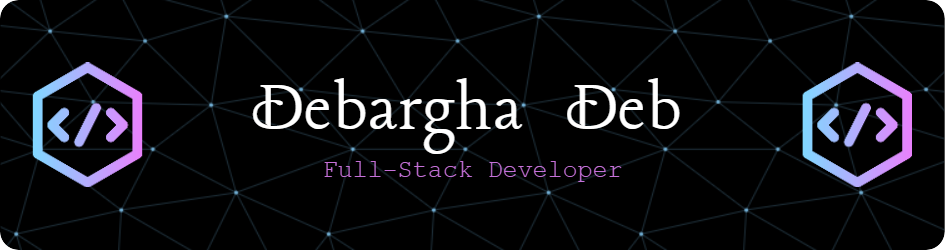

<h1 align="center">Hi 👋, I'm Debargha Deb</h1>
<h3 align="center">A passionate MERN Stack Developer | Programmer | CSE Undergrad from NIT Agartala</h3>
  

- 🔭 I’m currently pursuing **B.Tech in Computer Science & Engineering from NIT Agartala**

- 🌱 I’m currently learning **Springboot framework**

- 👯 I’m looking to collaborate on **Full Stack Web Development**

- 👨‍💻 All of my projects are available at [https://github.com/debargha-2002](https://github.com/debargha-2002)

- 💬 Ask me about **DSA & MERN Stack**

- 📫 How to reach me **ddeb36680@gmail.com**

<h3 align="left">Connect with me:</h3>

<!--

-->
<h3 align="left">Languages and Tools:</h3>

                   

<h3 align="left">Coding Profiles:</h3>

 

&nbsp;

